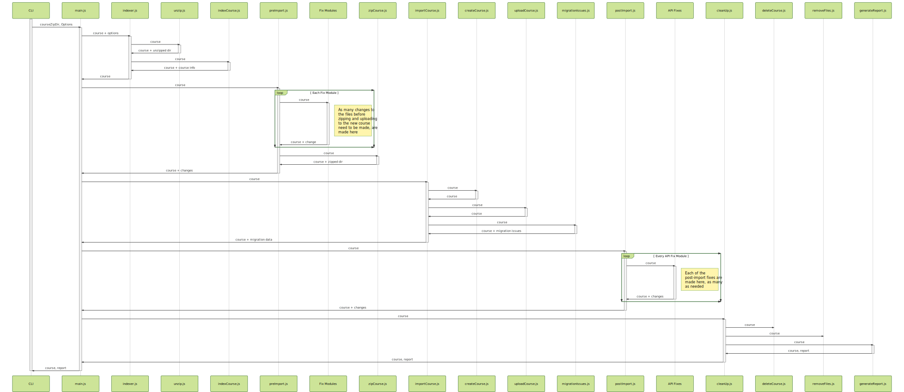

## You may need to download the image to view it properly.

The fix modules and api fix modules are set into a loop in this diagram to represent that we'll be doing all of the fix modules in that location, as many as are made in the end. The conversion from SVG to JPG removed some of the coloring and lines.

## Mermaid Code

This image was generated using [Mermaid](https://mermaidjs.github.io/mermaid-live-editor/#/edit/Z3JhcGggVEQKQVtDaHJpc3RtYXNdIC0tPnxHZXQgbW9uZXl8IEIoR28gc2hvcHBpbmcpCkIgLS0-IEN7TGV0IG1lIHRoaW5rfQpDIC0tPnxPbmV8IERbTGFwdG9wXQpDIC0tPnxUd298IEVbaVBob25lXQpDIC0tPnxUaHJlZXwgRltDYXJdCg)

sequenceDiagram

activate CLI
CLI ->> +main.js: courseZipDir, Options

main.js -X +indexer.js: course + options

indexer.js -X +unzip.js: course
unzip.js ->> -indexer.js: course + unzipped dir
indexer.js -X +indexCourse.js: course
indexCourse.js ->> -indexer.js: course + course info
indexer.js ->> -main.js: course

main.js -X +preImport.js: course
Loop Each Fix Module
preImport.js -X +Fix Modules: course
Note right of Fix Modules: As many changes to the files before zipping and uploading to the new course need to be made, are made here
Fix Modules ->> -preImport.js: course + change
end
preImport.js -X +zipCourse.js: course
zipCourse.js ->> -preImport.js: course + zipped dir
preImport.js ->> -main.js: course + changes

main.js -X +importCourse.js: course
importCourse.js -X +createCourse.js: course
createCourse.js ->> -importCourse.js: course
importCourse.js -X +uploadCourse.js: course
uploadCourse.js ->> -importCourse.js: course
importCourse.js -X +migrationIssues.js: course
migrationIssues.js ->> -importCourse.js: course + migration issues
importCourse.js ->> -main.js: course + migration data

main.js -X +postImport.js: course
Loop Every API Fix Module
postImport.js -X +API Fixes: course
Note right of API Fixes: Each of the post-import fixes are made here, as many as needed
API Fixes ->> -postImport.js: course + changes
end
postImport.js ->> -main.js: course + changes

main.js -X +cleanUp.js: course
cleanUp.js ->> deleteCourse.js: course
cleanUp.js ->> removeFiles.js: course
cleanUp.js ->> +generateReport.js: course
generateReport.js ->> -cleanUp.js: course, report
cleanUp.js ->> -main.js: course
main.js ->> -CLI: course + generated report
deactivate CLI

