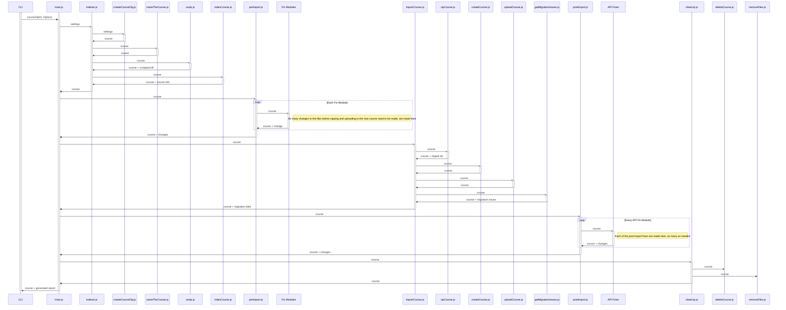

# Sequence Diagram

The `preImport` and `postImport` modules are represented as a loop since we don't know how many child modules will be present.

The diagram is generated using [Mermaid](https://mermaidjs.github.io/mermaid-live-editor/#/edit/Z3JhcGggVEQKQVtDaHJpc3RtYXNdIC0tPnxHZXQgbW9uZXl8IEIoR28gc2hvcHBpbmcpCkIgLS0-IEN7TGV0IG1lIHRoaW5rfQpDIC0tPnxPbmV8IERbTGFwdG9wXQpDIC0tPnxUd298IEVbaVBob25lXQpDIC0tPnxUaHJlZXwgRltDYXJdCg). View it [here](https://mermaidjs.github.io/mermaid-live-editor/#/edit/Z3JhcGggVEQKQVtDaHJpc3RtYXNdIC0tPnxHZXQgbW9uZXl8IEIoR28gc2hvcHBpbmcpCkIgLS0-IEN7TGV0IG1lIHRoaW5rfQpDIC0tPnxPbmV8IERbTGFwdG9wXQpDIC0tPnxUd298IEVbaVBob25lXQpDIC0tPnxUaHJlZXwgRltDYXJdCg) by copying/pasting the code, or download a package for your editor that allows it to be previewed there. Additionally, *sequenceDiagram.pdf* has the same contents.

