# Structure Chart

Because the above image is obviously way too small to read, we've broken it up into smaller structure charts. We hope your eyes revel in the simplicity.

**On each arrow-line to each function, there is some text. These indicate input/output. The left (input) is the parameter(s) we are passing in. The right is the output. "+=" indicates that the output is the same as the input, but with the described changes.**

# main.js

# indexer.js

# preImport.js

# importCourse.js

# postImport.js

# cleanUp.js

### Mermaid input
graph TD;
CLI-->|zipDir, Options/report|main.js;

id1[Text on lines indicates input/output for each function];

main.js -.-> |course/course += options| indexer.js;
indexer.js -.-> |course/course += unzipped dir| unzip.js;
indexer.js -.-> |course/course += course info| indexCourse.js;

main.js -.-> |course/course += all changes| preImport.js;
preImport.js -.-> |course/course += change|fix-1.js;
preImport.js -.-> |course/course += change| fix-2.js;
preImport.js -.-> |course/course += change| fix-3.js;
preImport.js -.-> |course/course += change| fix-n.js;
preImport.js -.-> |course/course + zip dir| zipCourse.js;

main.js -.-> |course/course| importCourse.js;
importCourse.js -.-> |course/course += migration data| createCourse.js;
importCourse.js -.-> |course/course| uploadCourse.js;
importCourse.js -.-> |course/course + migration issues| migrationIssues.js;

main.js -.-> |course/course += changes| postImport.js;
postImport.js -.-> |course/course += change| apiFix-1.js;
postImport.js -.-> |course/course += change| apiFix-2.js;
postImport.js -.-> |course/course += change| apiFix-3.js;
postImport.js -.-> |course/course += change| apiFix-n.js;

main.js -.-> |course/report| cleanUp.js
cleanUp.js -.-> |course| deleteCourse.js
cleanUp.js -.-> |course| removeFiles.js
cleanUp.js -.-> |course/report| generateReports.js
