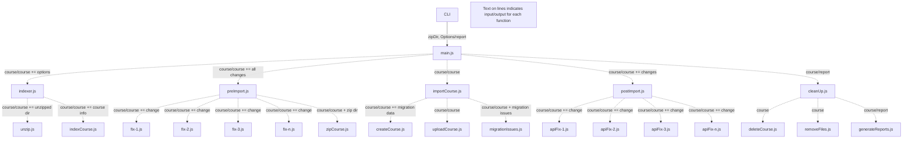
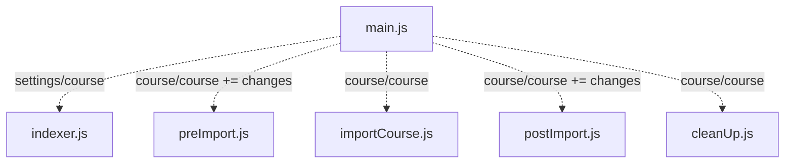
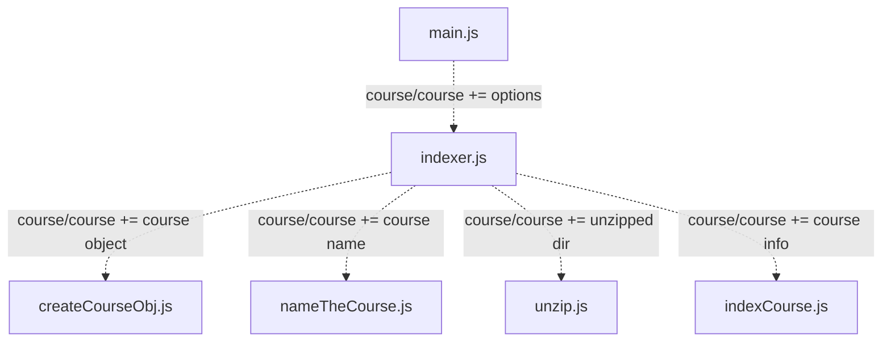
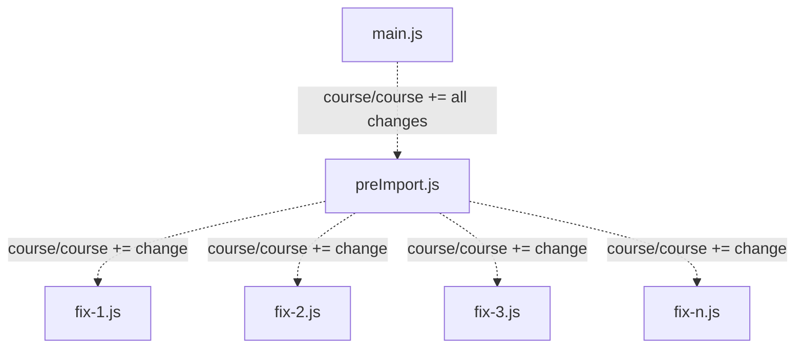
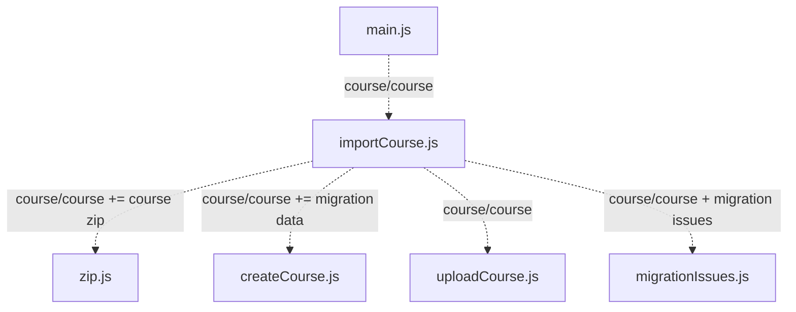
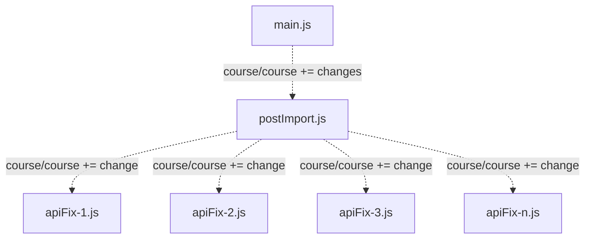
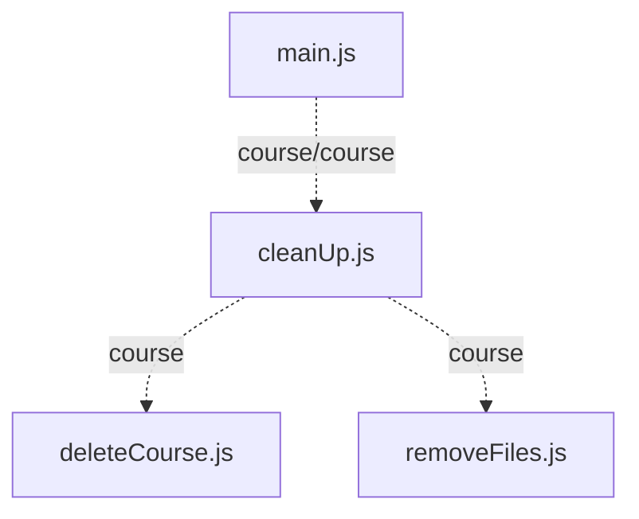

# Structure Chart

These diagrams are generated using [Mermaid](https://mermaidjs.github.io/mermaid-live-editor/#/edit/Z3JhcGggVEQKQVtDaHJpc3RtYXNdIC0tPnxHZXQgbW9uZXl8IEIoR28gc2hvcHBpbmcpCkIgLS0-IEN7TGV0IG1lIHRoaW5rfQpDIC0tPnxPbmV8IERbTGFwdG9wXQpDIC0tPnxUd298IEVbaVBob25lXQpDIC0tPnxUaHJlZXwgRltDYXJdCg). View them [here](https://mermaidjs.github.io/mermaid-live-editor/#/edit/Z3JhcGggVEQKQVtDaHJpc3RtYXNdIC0tPnxHZXQgbW9uZXl8IEIoR28gc2hvcHBpbmcpCkIgLS0-IEN7TGV0IG1lIHRoaW5rfQpDIC0tPnxPbmV8IERbTGFwdG9wXQpDIC0tPnxUd298IEVbaVBob25lXQpDIC0tPnxUaHJlZXwgRltDYXJdCg) by copying/pasting the code, or download a package for your editor that allows it to be previewed there. Additionally, *structureChart.pdf* has the imaged code.

Because the above image is obviously way too small to read, we've broken it up into smaller structure charts. We hope your eyes revel in the simplicity.

**On each arrow-line to each function, there is some text. These indicate input/output. The left (input) is the parameter(s) we are passing in. The right is the output. "+=" indicates that the output is the same as the input, but with the described changes.**

# main.js

# indexer.js

# preImport.js

# importCourse.js

# postImport.js

# cleanUp.js

